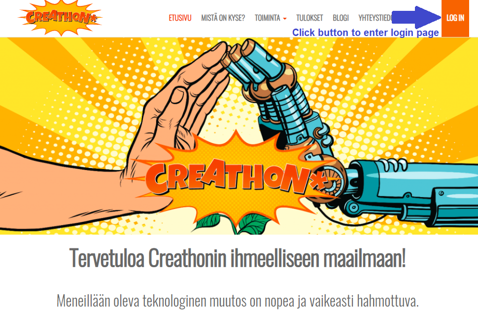
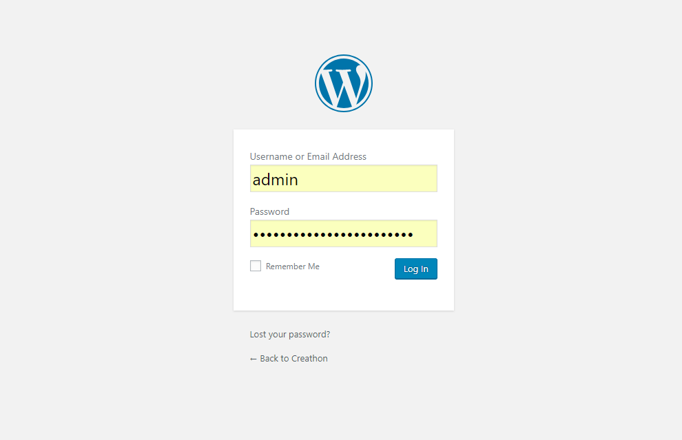
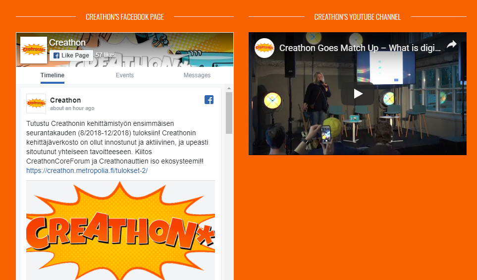
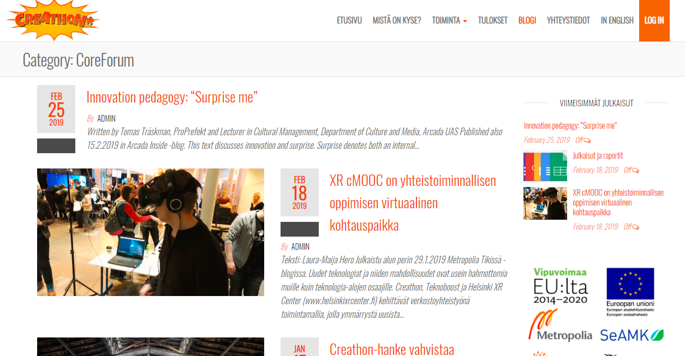
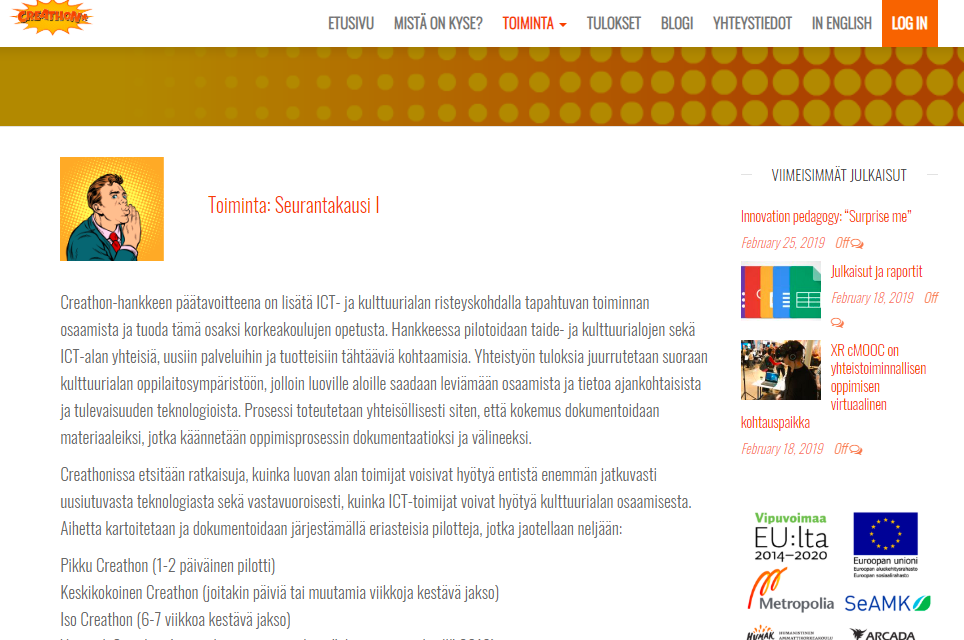
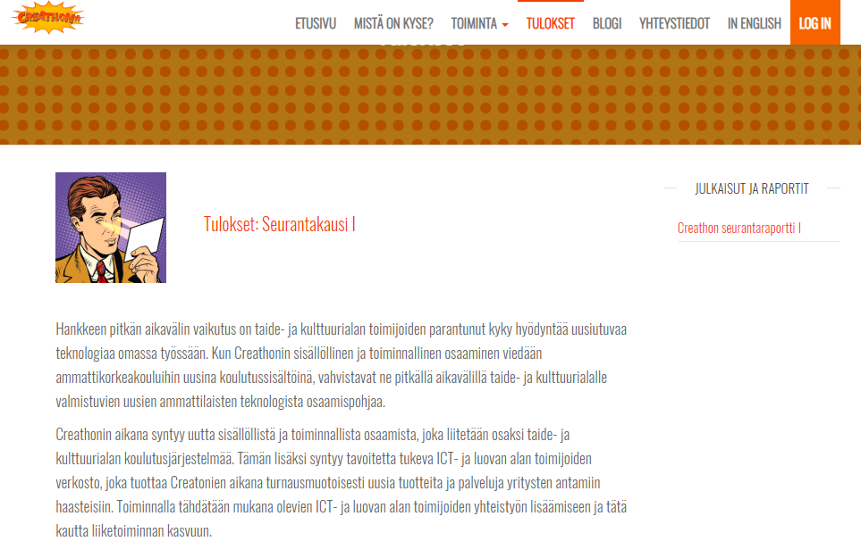

# Creathon Website Report and Documentation
## Table of Contents
- [Creathon Website Report and Documentation](#creathon-website-report-and-documentation)
  - [Table of Contents](#table-of-contents)
    - [Motivation and objective](#motivation-and-objective)
    - [Project Schedule](#project-schedule)
    - [Features and Requirements](#features-and-requirements)
  - [Evaluation](#evaluation)
  - [Documentation requirements](#documentation-requirements)
### [Motivation and objective](#motivation-objective)
I was approached with the Creathon website development as a similar project called [TeenMinno project](https://wiki.metropolia.fi/display/teiniminnoesp/TEINIMINNOTALKOOT+2016-2018) was being managed by the same project manager Laura-Maija Hero. Even though Creathon had similarity in certain objectives, as a project with its own identity, a standalone website was in need to enhance Creathon's activities management.

While the project management team was planning on developing a website, they reached out for my opinion regarding choice of technology to build a webiste and I suggested certain options based on the requirements. I was afterwards asked to work on and given that the Augmented Reality experimental projects in hand were complete, I was more than glad to take the role of the main developer for the Creathon website.

### [Project Schedule](#project-schedule)
During the first brainstorming session and during the early phase of the development, it was planned to be finished within 4 weeks of project development. Due to certain budget constraint, the deadline was stretched couple of weeks longer. 
The schedule of each phase in brief was as follows:
- ___Project planning and getting initial contents ready:__ 1 week_
- ___Website development (Roughly 2 days each page):__ 2 weeks_
- ___Feedback and changes:__ 1 week_
- ___Deployment:__ 1 week_

Of the later extended 6 weeks timeline, at first half a week was consumed for dealing with deployment due to database and host access info providing issues by the IT admin, and the rest was utilized mostly for feedback and changes.

### [Features and Requirements](#features-requirements)
During the brainstorming session it was planned the website will require the following sections, with certain pages being dynamically upgradable (posts), and rest will be static pages with more custom design: 
- Etusivu/Yleistä hankkeesta: Static page
- Viestintä/Julkaisut: Upgradeable page
- Materiaalipankki (tänne alasivuiksi esim. logot, tutkimukset, selvitykset, raportit yms): Dynamically upgradeable
- CreathonCoreForum: Static page
- Ohjeita työntekijöille: Static page
- Yhteystiedot (tänne myös alasivuksi hallinto): Static page
- Blogi: Dynamically upgradeable feed, and individual blog posts
- In English: Static page

Originally planned features and requirements were:
- A page where external users would be able post their content updates which will result in dynamically upgrading the page. Later on it seemed that wouldn't be needed.
- External users signup
- Social media feed widgets
- Events feed and separate details page

However, after first week's planning and over the week while contents were being delivered, the following sections were considered to be kept in the website:
- [Etusivu]([www.goole.com](https://creathon.metropolia.fi/)): Static page
- [Mistä on kyse](https://creathon.metropolia.fi/mista-on-kyse/): Static page
- [Toiminta](https://creathon.metropolia.fi/toiminta/): Satic page
  - [CreathonCoreForum](https://creathon.metropolia.fi/creathoncoreforum/): Static page
  - [Pilotit](https://creathon.metropolia.fi/pilotit/): Upgradeable
  - [Tulokset](https://creathon.metropolia.fi/tulokset/): Static page with dynamically upgradeable sidebar with new reports
  - [Blogi](https://creathon.metropolia.fi/category/blog/): Dynamically upgradeable feed
    - [Blog posts](https://creathon.metropolia.fi/2019/02/18/xr-cmooc-on-yhteistoiminnallisen-oppimisen-virtuaalinen-kohtauspaikka/)
  - [Yhteystiedot](https://creathon.metropolia.fi/yhteystiedot/): Static page

As for the final technical features that were developed are:
- __Login feature for page admin and editors__
  
  _Figure: Login button_

  _Figure: Login page_
- __Dynamically upgradeable social media feeds__
  _Figure: Dynamically upgradeable social media feed_
- __Blog posts feed__
  _Figure: Blog posts feed_
- __Custom dynamically upgradeable sidebar for reports__
  _Figure: Regular sidebar on the right_
  _Figure: Custom dynamically upgrading sidebar for reports links on the right_

## Evaluation
The website is meant to represent a youth focused creative project and from that perspective, the final fun and colorful appearance is quite able to do so. The overall graphic, theme color combo, and spinner when page loading is a decent implementation from visual perspective that goes with Creathon's theme. 

Functionally a lot more could have been done but project timeline is always a constraint which sometimes does not allow us to do everything we could wish to do. However, with given time, the final website does provide more than being just a minimum viable product. 

From UX and modern UI trend perspective, a single page UI would have allowed the website to look more modern. However, as the website is very text content heavy and requires separate blog sections, it does not look dated even from UX UI point of view. 

Lastly, with a bit longer development timeline, the frontend could have been made faster if it was developed with perhaps faster frontend generators such as React.js or frameworks such as Gatsby.js.  

## Documentation requirements
- ~~Project motivation and description~~
- ~~Original project schedule and the actual project schedule~~
- ~~*Description of features* (what does your web app do, what are the most important features). Original planned functionalities and was all of them implemented~~
- Own eevaluation of the final product
- *Motivation* (what problem does your web app solve, why did you decide to build this project)
- *Installation and set up guide* ("git clone and run with npm start"... "make sure you have these libraries installed")
- *howto*: small examples of use cases (include pictures/gifs if possible)
- *API reference* (if you are using an API, provide a link to their reference doc)
- *Credits* (links to the profiles of contributors)
- *FAQ*
- *Contact information*